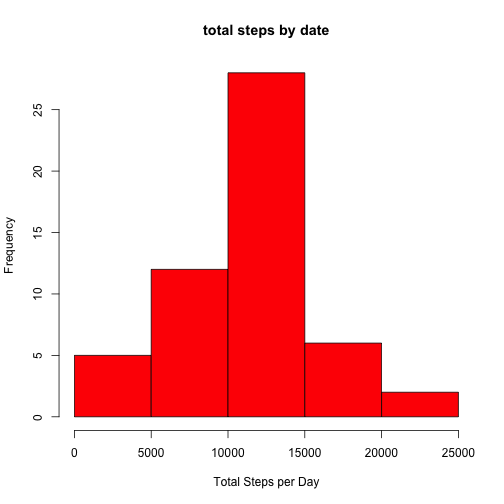
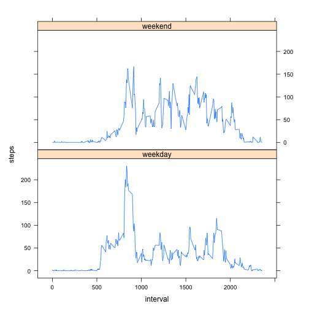

#RepData peer Assesssment 1
========================================================

##Loading and preprocessing the data
load data from activity.csv

```r
data <- read.csv("activity.csv")
head(data)
```

```
##   steps       date interval
## 1    NA 2012-10-01        0
## 2    NA 2012-10-01        5
## 3    NA 2012-10-01       10
## 4    NA 2012-10-01       15
## 5    NA 2012-10-01       20
## 6    NA 2012-10-01       25
```

```r
asDate <- strptime(data$date, "%Y-%m-%d")
newData <- cbind(data, asDate)
activity <- data.frame(newData$steps , newData$asDate, newData$interval)
names(activity) <- c("steps", "date", "interval")
```

##What is mean total number of steps taken per day?
remove NA value

```r
good <- complete.cases(activity)
completeData <- activity[completeData,]
```

```
## Error: object 'completeData' not found
```

```r
totalSteps <- tapply(activity$steps, activity$date, sum)
```
draw histogram of total steps

```r
hist(totalSteps, col = "red", xlab = "Total Steps per Day", ylab = "Frequency", 
     main = "total steps by date")
```

 

```r
mean <- mean(completeData$steps)
```

```
## Error: object 'completeData' not found
```

```r
mean
```

```
## function (x, ...) 
## UseMethod("mean")
## <bytecode: 0x106635ff0>
## <environment: namespace:base>
```

```r
median <- median(completeData$steps)
```

```
## Error: object 'completeData' not found
```

```r
median
```

```
## function (x, na.rm = FALSE) 
## UseMethod("median")
## <bytecode: 0x100f019c8>
## <environment: namespace:stats>
```
##What is the average daily activity pattern?
Make a time series plot (i.e. type = "l") of the 5-minute interval (x-axis) and the average number of steps taken, averaged across all days (y-axis)

```r
stepsInterval<-aggregate(steps~interval,data=activity, FUN=mean, na.rm=TRUE)
head(stepsInterval)
```

```
##   interval   steps
## 1        0 1.71698
## 2        5 0.33962
## 3       10 0.13208
## 4       15 0.15094
## 5       20 0.07547
## 6       25 2.09434
```

```r
plot(steps~interval,data=stepsInterval,type="l")
```

 
Which 5-minute interval, on average across all the days in the dataset, contains the maximum number of steps?

```r
max <- max(stepsInterval$steps)
max
```

```
## [1] 206.2
```

##Imputing missing values
calculate total number of missing data

```r
sum(is.na(activity))
```

```
## [1] 2304
```

```r
missingNum <- length(which(is.na(activity$steps)))
```

Devise a strategy for filling in all of the missing values in the dataset. 
Use the mean for that 5-minute interval

```r
stepFit <- function(interval) {
        stepsInterval[stepsInterval$interval == interval, ]$steps
}

newDataset <- activity 
count = 0 
for (i in 1:nrow(newDataset)) {
        if (is.na(newDataset[i, ]$steps)) {
                newDataset[i, ]$steps <- stepFit(newDataset[i, ]$interval)
                count = count + 1
        }
}
newTotalSteps <- aggregate(steps ~ date, data = newDataset, sum)
head(newTotalSteps)
```

```
##         date steps
## 1 2012-10-01 10766
## 2 2012-10-02   126
## 3 2012-10-03 11352
## 4 2012-10-04 12116
## 5 2012-10-05 13294
## 6 2012-10-06 15420
```

```r
hist(newTotalSteps$steps, main = "Filled value histogram", xlab = "steps")
```

 
Calculate and report the mean and median total number of steps taken per day

```r
mean(newTotalSteps$steps)
```

```
## [1] 10766
```

```r
median(newTotalSteps$steps)
```

```
## [1] 10766
```

#Are there differences in activity patterns between weekdays and weekends?
Create a new factor variable in the dataset with two levels -- "weekday" and "weekend" indicating whether a given date is a weekday or weekend day.
weekdays(newDataset$date)

```r
newDataset$weektime <- as.factor(ifelse(weekdays(newDataset$date) %in% c("Saturday","Sunday"),
                             "weekend", "weekday"))
```
Make a panel plot containing a time series plot 

```r
stepsInterval2 = aggregate(steps ~ interval + weektime, newDataset, mean)
library(lattice)
xyplot(steps ~ interval | factor(weektime), data = stepsInterval2, aspect = 1/2, 
       type = "l")
```

 
